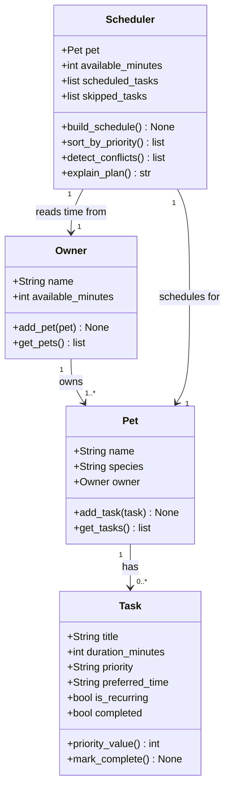

# PawPal+ UML Class Diagram

> This diagram reflects the initial design. It will be updated in Phase 6 to match the final implementation.

```mermaid
classDiagram
    class Owner {
        +String name
        +int available_minutes
        +add_pet(pet) None
        +get_pets() list
    }

    class Pet {
        +String name
        +String species
        +Owner owner
        +add_task(task) None
        +get_tasks() list
    }

    class Task {
        +String title
        +int duration_minutes
        +String priority
        +String preferred_time
        +bool is_recurring
        +bool completed
        +priority_value() int
        +mark_complete() None
    }

    class Scheduler {
        +Pet pet
        +int available_minutes
        +list scheduled_tasks
        +list skipped_tasks
        +build_schedule() None
        +sort_by_priority() list
        +detect_conflicts() list
        +explain_plan() str
    }

    Owner "1" --> "1..*" Pet : owns
    Pet "1" --> "0..*" Task : has
    Scheduler "1" --> "1" Pet : schedules for
    Scheduler "1" --> "1" Owner : reads time from
```
