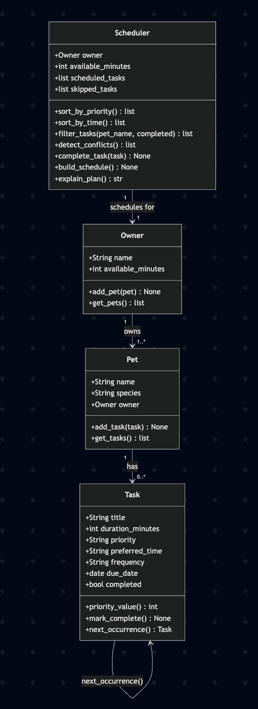
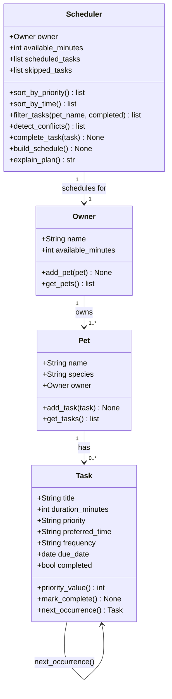

# PawPal+ UML Class Diagram

> Updated in Phase 6 to reflect the final implementation.

## What changed from the initial design

| | Initial | Final |
|---|---|---|
| `Task.is_recurring` | `bool` | Replaced by `frequency` (`"daily"` / `"weekly"` / `None`) |
| `Task.due_date` | not present | Added — used by `next_occurrence()` with `timedelta` |
| `Task.next_occurrence()` | not present | Returns a new Task shifted by frequency interval |
| `Scheduler` input | `(pet, owner)` | `(owner)` only — collects tasks across all pets via `_all_tasks()` |
| `Scheduler → Pet` | direct relationship | Now indirect — accessed through `Owner.get_pets()` |
| New Scheduler methods | — | `sort_by_time()`, `filter_tasks()`, `complete_task()`, `detect_conflicts()` |
